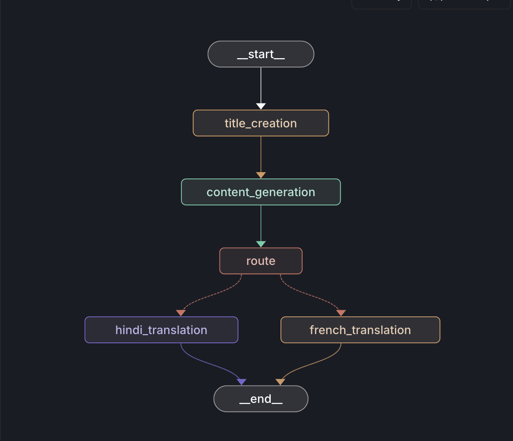
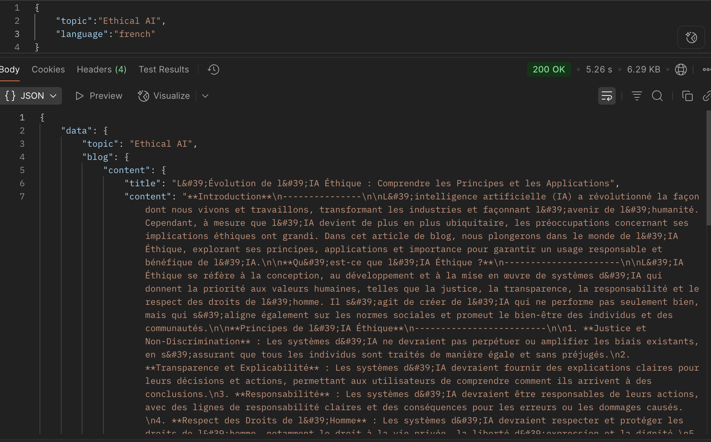

# 🧠 BlogAgentic – Multilingual Blog Generator

Generate SEO-friendly blogs in multiple languages (like Hindi & French) using **LangGraph**, **FastAPI**, and **Groq's LLMs (LLaMA 3)**. This project demonstrates a graph-based approach to AI workflows for content generation and translation.

---

## 🚀 Features

- 🌐 Accepts `topic` and optional `language` via API.
- ✍️ Generates a creative blog title and detailed content.
- 🌍 Translates blog to Hindi or French using conditional routing.
- ⚙️ LangGraph integration for node-based LLM orchestration.
- 📊 LangSmith-compatible for tracing & debugging.

---

## 🧱 Tech Stack

| Tool        | Purpose                                |
|-------------|----------------------------------------|
| FastAPI     | Web framework for API endpoints        |
| LangGraph   | Build dynamic LLM workflows as graphs  |
| Groq        | LLM provider (LLaMA 3.1 8B Instant)    |
| LangChain   | LLM abstraction & chaining              |
| Uvicorn     | ASGI server                            |
| Python-dotenv | Load env variables securely          |

---

## 📁 Project Structure

BlogAgentic/
│
├── app.py                         # FastAPI server  
├── requirements.txt               # Dependencies  
├── .env                           # Environment variables  
│
├── src/
│   ├── llms/
│   │   └── groqllm.py             # LLM wrapper (Groq)
│   ├── states/
│   │   └── blogstate.py           # BlogState & Blog model
│   ├── nodes/
│   │   └── blog_node.py           # Blog generation nodes
│   └── graphs/
│       └── graph_builder.py       # Graph construction logic
│
└── langgraph.yaml                 # LangGraph Studio config
---

## 🛠️ Setup Instructions

### 1. Clone the repo

```bash
git clone https://github.com/Aditya2600/BlogAgentic-Multilingual-Blog-Generator.git
cd BlogAgentic

2. Create virtual environment using uv

uv venv
source .venv/bin/activate

3. Install dependencies

uv pip install -r requirements.txt

4. Setup .env

Create a .env file with:

GROQ_API_KEY=your_groq_api_key
LANGCHAIN_API_KEY=your_langsmith_api_key


⸻

🔄 Run the FastAPI server

uvicorn app:app --reload

API will be available at:
	•	Swagger UI → http://127.0.0.1:8000/docs
	•	Endpoint → POST /blogs


## 🔁 Sample Blog Generation via API

### 📬 Postman Request:


### 🧠 LangGraph Visual Workflow:


⸻

🧠 How LangGraph Works Here

The app builds 2 graph variants:
	•	Topic-only graph → START ➝ title_creation ➝ content_generation ➝ END
	•	Language graph → Adds:
	•	route_decision
	•	Conditional translation (hindi_translation / french_translation)

LangGraph allows flexible workflows with conditional branching based on language input.

⸻

🧪 LangGraph Studio Integration

Run the local dev server to monitor graph visually:

langgraph dev

	•	Studio URL: https://smith.langchain.com/studio/?baseUrl=http://127.0.0.1:2024
	•	Track node-level LLM activity via LangSmith

Make sure your langgraph.yaml is set like:

dependencies: ["."]
graphs:
  blog_generator_agent: ./src/graphs/graph_builder.py:graph
env: ./.env


⸻

📦 Freeze dependencies

uv pip freeze > requirements.txt


⸻

✍️ Author

Aditya Meshram
B.Tech IT | NIT Raipur
💼 Project: AI x LangChain Workflow Automation


⸻

📄 License

MIT License – free for commercial & personal use

⸻


